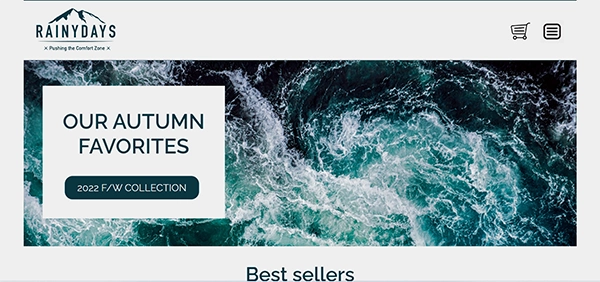

# RainyDays


Rainydays was the first website I made with coding. The assignment was to code the website we made in XD Design using HTML and CSS. Six months after we got to make some changes to the design and add in vanilla JavaScript.   

## Description

The first time we got this assignment the goal was to put into practice everything we learned about HTML and CSS over that course. The brief was to make a website for Rainydays, wich was selling rain jackets. We were supose to keep the HTML neat and try to make it as realistic as we could. I focused on accesability, wcag and getting semantic html.

Later, we made some changes on the site and added JavaScript. We had to install Hotjar and make changes from what feedback we got. We also had to modify the existing Cross-Course Project to fetch products from an external API.    

Under is some of the requirements we had to meet

- Look through your website and assess where API calls need to be made to dynamically add content. You should have a products page and a product details page, but there might be other pages like the home page where products are loaded.
- Remove the hardcoded products from the HTML.
- Add loading indicators when making API calls.
- On the product details page make a request to the API for the specific data for the product that the user has clicked on.
- Ensure proper error handling. 

## Built With

Tech stack for this project  

- [HTML5](https://dev.w3.org/html5/spec-LC/)
- [CSS](https://www.w3.org/Style/CSS/Overview.en.html)
- [JavaScript](https://developer.mozilla.org/en-US/docs/Web/JavaScript)

## Getting Started

### Installing

To clone this repo you run the command that is listed under here. From there you can make your changes and deploy it as you like. I recommend Netlify + Github. This project is written 100% by me, and you can use it however you like.

1. Clone the repo:

```bash
git clone git@github.com:bettytro/RainyDays.git
```


### Running

This project is fully built on front-end tools like HTML & CSS. There is no dependencies or setup to make it run optimally. You can run it in your normal browser. Just open index.html in your favorite browser, and you're all good.


## Contributing

If you want to contribute to this project, you can message me on any of my socials. You can find them on my [Github profile](https://github.com/bettytro). I will not observe this project that closely, but please make a pull request, and I will review it as soon as possible.

## Contact

If you want to get in touch, please send me a message on Facebook or Discord 

[My Facebook](https://www.facebook.com/elisabeth.trondsen.14/)

[My Discord](discordapp.com/users/yourID1009006668291518517)
 